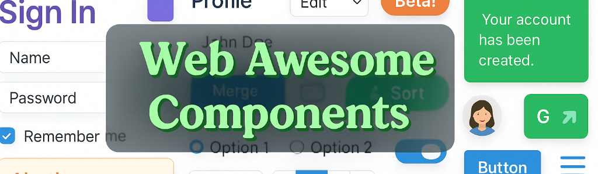

# Web Awesome Components List

Here I've attempted to document a comprehensive set of lists of all components in the Web Awesome library, free and pro, completed and upcoming. Lists include alphabeticized, categorized, and merged and categorized.

"Free" indicates the component is provided under Web Awesome's open-source tier — the full suite of <wa-\*> custom elements without any "PRO" restrictions.

🌟 "**Pro**" components are available to those who have pre-ordered Web Awesome Pro via the [KickStarter campaign](https://www.kickstarter.com/projects/fontawesome/web-awesome).

# Table of Contents

1. [Free Components, Alphabetical](#free-components-alphabetical)
2. [Free Components, Categorized](#free-components-categorized)
    - [Form Controls](#form-controls)
    - [Layout & Structure (Categorized)](#layout--structure-categorized)
    - [Feedback & Indicators (Categorized)](#feedback--indicators-categorized)
    - [Utilities & Observers (Categorized)](#utilities--observers-categorized)
    - [QR Code](#qr-code)
    - [Key Notes](#key-notes)
3. [🌟 **Pro** Components & **Pro** Patterns](#-pro-components--pro-patterns)
    - [🌟 **Pro Components**](#-pro-components)
    - [🌟 **Pro** "Patterns"](#-pro-patterns)
        - [App Patterns 🌟](#app-patterns-)
        - [Blog & News Patterns 🌟](#blog--news-patterns-)
        - [Ecommerce Patterns 🌟](#ecommerce-patterns-)
        - [Layouts Patterns 🌟](#layouts-patterns-)
4. [Free and 🌟 **Pro** Components Categorized](#free-and--pro-components-categorized)
    - [Forms & Inputs](#forms--inputs)
    - [Layout & Structure](#layout--structure)
    - [Feedback & Indicators](#feedback--indicators)
    - [Content & Blog / News](#content--blog--news)
    - [Commerce](#commerce)
    - [Utilities / Observers](#utilities--observers)
    - [Design & Theming](#design--theming)
    - [Takeaways](#takeaways)
5. [Web Awesome Free vs 🌟 Pro Components Table](#web-awesome-free-vs--pro-components-table)
    - [At a Glance](#at-a-glance)
6. [Web Awesome Free vs. 🌟 **Pro** Components Chart](#web-awesome-free-vs--pro-components-chart)
    - [Visual Chart](#visual-chart)
    - [Data Visualization & Collaboration Style Indicators (Feedback & Indicators)](#data-visualization--collaboration-style-indicators-feedback--indicators)

## Free Components, Alphabetical

From the official documentation (Components list), here's every enabled component without the 🌟 **Pro** label, meaning they are part of the fully open-source, free core of Web Awesome:

- Animated Image
- Animation
- Avatar
- Badge
- Breadcrumb
  - Breadcrumb Item
- Button
- Button Group
- Callout
- Card
- Carousel
- Carousel Item
- Checkbox
- Color Picker
- Comparison
- Copy Button
- Details
- Dialog
- Divider
- Drawer
- Dropdown
- Dropdown Item
- File Input ([Free stretch goal](https://github.com/shoelace-style/webawesome/issues/1240))
- Format Bytes
- Format Date
- Format Number
- Icon
- Include
- Input
- Mutation Observer
- Popover
- Popup
- Progress Bar
- Progress Ring
- QR Code
- Radio Group
- Radio
- Rating
- Relative Time
- Resize Observer
- Scroller
- Select
- Option
- Skeleton
- Slider
- Spinner
- Split Panel
- Switch
- Tab Group
- Tab
- Tab Panel
- Tag
- Textarea
- Tooltip
- Tree
- Tree Item
- Zoomable Frame

## Free Components, Categorized

### Form Controls
- Button
- Button Group
- Checkbox
- Color Picker
- Copy Button
- Input
- Radio Group
  - Radio
- Select
  - Option
- Slider
- Switch
- Textarea
- File Input ([Free stretch goal](https://github.com/shoelace-style/webawesome/issues/1240))

### Layout & Structure (Categorized)
- Avatar
- Breadcrumb
  - Breadcrumb Item
- Card
- Carousel
  - Carousel Item
- Divider
- Drawer
- Split Panel
- Tab Group
  - Tab
  - Tab Panel
- Tree
  - Tree Item

### Feedback & Indicators (Categorized)
- Badge
- Callout
- Dialog
- Popover
- Popup
- Progress Bar
- Progress Ring
- Rating
- Skeleton
- Spinner
- Tag
- Tooltip

### Utilities & Observers (Categorized)
- Animated Image
- Animation
- Details
- Dropdown
  - Dropdown Item
- Format Bytes
- Format Date
- Format Number
- Icon
- Include
- Mutation Observer
- Relative Time
- Resize Observer
- Scroller
- Zoomable Frame
- QR Code

### QR Code

### Key Notes

- All the above are **confirmed free** (no PRO tag).
- Most have **"Since" version info** in the docs (e.g., "Since 2.0 stable").
- Some of the newest free additions (from changelogs) include **Scroller**, **Popover**, and **Zoomable Frame**, now merged into the main list.

## 🌟 **Pro** Components & **Pro** Patterns

Here is the alphabetical list of all current Web Awesome 🌟 **Pro** Components and **Pro** Patterns.

Patterns are distinct from Components as they are copy/pasteable HTML and not custom HTML elements. They are able to provide some amazing new capability and add a lot to any site using the **Pro** components.

[Check here for updates](https://github.com/shoelace-style/webawesome/issues?q=sort%3Aupdated-desc+is%3Aissue+state%3Aopen+label%3A%22WA+Pro%22) on the development of upcoming 🌟 **Pro** Components, such as Chart, Combobox, Data Grid, Date picker, Themer, and Google Font imports.

### 🌟 **Pro Components**

-  App (layout)
-  Banners
-  Call To Action
-  Category Filter
-  Category List
-  Category Preview
-  Checkout Form
-  Contact
-  Ecommerce (layout)
-  Featured Post
-  Footer
-  Grid Section
-  Header
-  Incentives
-  Newsletter
-  Numbers
-  Order History
-  Order Summary
-  Paywall
-  Permissions
-  Post Footer
-  Post Header
-  Post List
-  Pricing
-  Product Lists
-  Product Overview
-  Product Preview
-  Product Reviews
-  Shopping Cart
-  Sign Up & Login
-  Social Share
-  Teams
-  Testimonials
-  Theme Builder PRO (tool for creating custom themes)

### 🌟 **Pro** "Patterns"
Patterns are distinct from Components as they are copy/pasteable HTML and not custom HTML elements.

<!-- https://webawesome.com/docs/patterns/ -->

#### App Patterns 🌟

-  Action Panel
  - Simple
  - With Flanked Button
  - With Switch
  - Avatar and Quick actions
- Activity Log
  - Simple
  - Timeline with Icons
  - With Expandable Details
  - Card Separated
  - Divider Separated
- Comments
  - Card with Header & Footer
  - Card with Thread
  - With Avatar & Additional Actions
  - Rich Card with Multiple Actions
  - With Preview Pane
- Data Display
  - Simple
  - Cards with Avatars
  - Condensed Card
- Description List
  - Left Aligned
  - Two Column
  - Left Aligned with Actions
  - Condensed
- Empty State
  - Simple
  - With Interactive Placeholder
  - With Templates
  - Add people
- FAQ
  - With Flanked Heading & Description
  - With Expandable Answers
  - Two Column
  - Multiple Columns
- Grid List
  - Cards with Footer Actions
  - Cards with Footer Actions & Large Image
  - With Images
  - Linked Cards with Options Menu
  - Kanban
- Leaderboard
  - Simple
  - Two Column
- Pagination
  - Simple
  - With Button Group
- Password
  - Password Recovery
  - Two Factor Authentication
- Permissions
  - With Form Inputs
  - Link Settings
  - Role Settings
- Pricing
  - Three Tiers
  - Single Tier

#### Blog & News Patterns 🌟

  - Banners
  - Call To Action
  - Category List
  - Contact
  - Featured Post
  - Footer
  - Grid Section
  - Header
  - Newsletter
  - Paywall
  - Post Footer
  - Post Header
  - Post List
  - Sign Up & Login
  - Numbers
  - Social Share
  - Teams
  - Testimonials

#### Ecommerce Patterns 🌟

  - Category Filter
  - Category Preview
  - Checkout Form
  - Incentives
  - Order History
  - Order Summary
  - Product Lists
  - Product Overview
  - Product Preview
  - Product Reviews
  - Shopping Cart

#### Layouts Patterns 🌟

  - Ecommerce
  - App
  - Blog

## Free and 🌟 **Pro** Components Categorized

Here’s a **cross-mapping** of **Free vs Pro components** by category, so you can quickly see overlaps, complements, and where the Pro tier adds unique value. This is based on the official [Web Awesome Docs](https://webawesome.com/docs/) component listings.

### Forms & Inputs

**Free**
- Button
- Button Group
- Checkbox
- Switch
- Radio Group
  - Radio
- Input 
- Textarea
- Select
- Option
- Slider
- Color Picker
- Copy Button
- File Input ([Free stretch goal](https://github.com/shoelace-style/webawesome/issues/1240))

🌟 **Pro**
- Combobox (autocomplete/typeahead) 🌟
- Date Picker 🌟

Free covers the basics.  
🌟 **Pro** adds richer inputs like Combobox, Date Picker.

### Layout & Structure

**Free**
- Card
- Carousel (+Item)
- Drawer
- Split Panel
- Tab Group (+Tab, Tab Panel)
- Tree (+Tree Item)
- Breadcrumb (+Item)

🌟 **Pro**
- App Layout 🌟
- Blog Layout 🌟
- Ecommerce Layout 🌟
- Action Panel 🌟
- Grid List 🌟

Free gives core primitives.  
🌟 **Pro** provides "full-page" layouts and higher-level panels/lists for application scaffolding.

### Feedback & Indicators

**Free**
- Badge
- Tag
- Callout
- Dialog
- Tooltip
- Popover
- Popup
- Progress Bar
- Progress Ring
- Rating
- Skeleton
- Spinner

🌟 **Pro**
- Data Grid 🌟 (structured datasets, tables)
- Charts 🌟 (graphs/visualizations)
- Activity Log 🌟
- Comments 🌟
- Leaderboard 🌟
- Toast & Toast Item (upcoming) 🌟

Free = visual state indicators.  
🌟 **Pro** = data-heavy visualization & collaboration components.

### Content & Blog / News

**Free**
  - Avatar
  - Animated Image
  - Animation

🌟 **Pro**
  - Banners 🌟
  - CTA 🌟
  - Category List 🌟
  - Contact 🌟
  - Featured Post 🌟
  - Footer 🌟
  - Grid Section 🌟
  - Header 🌟
  - Newsletter 🌟
  - Paywall 🌟
  - Post Footer 🌟
  - Post Header 🌟
  - Post List 🌟
  - Sign Up/Login 🌟
  - Numbers 🌟
  - Social Share 🌟
  - Teams 🌟
  - Testimonials 🌟

Free doesn’t focus on CMS/blogging.  
🌟 **Pro** fills in full-site content marketing patterns.

### Commerce

**Free**
  - QR Code (indirect utility for commerce)

🌟 **Pro**
  - Category Filter  🌟
  - Category Preview 🌟
  - Checkout Form 🌟
  - Incentives 🌟
  - Order History  🌟
  - Order Summary 🌟
  - Product Lists 🌟
  - Product Overview 🌟
  - Product Preview 🌟
  - Product Reviews 🌟
  - Shopping Cart 🌟

🌟 Ecommerce is **Pro-exclusive**: checkout flows, product displays, order management.

### Utilities / Observers

**Free**
  - Format Bytes / Date / Number
  - Include
  - Mutation Observer, Resize Observer
  - Relative Time
  - Scroller
  - Zoomable Frame

🌟 **Pro**
  - Permissions 🌟
  - Pricing 🌟
  - FAQ 🌟
  - Empty State 🌟
  - Description List 🌟
  - Intersection Observer (upcoming) 🌟

Free gives functional DOM & format helpers.  
🌟 **Pro** layers in "business-ready" utilities like pricing, permissions, and empty-state UX.

### Design & Theming

**Free**
  - Core CSS variables + themes baked in

🌟 **Pro**
  - Theme Builder (in beta now) 🌟
  - Figma plugin + design files (upcoming) 🌟

🌟 **Pro** gives advanced theming/design tooling and editable design assets.

### Takeaways

1. **Free = primitives**: Buttons, cards, modals, spinners, tabs, etc. Enough for most web apps.
2. 🌟 **Pro = opinionated patterns**: Layouts, blog/e-commerce flows, data-heavy charts & grids, and advanced theming tools.
3. **Strategic gap**: Anything requiring **commerce, data visualization, or higher-order layouts** pushes you into Pro.
4. **Free covers basics extremely well**; you won’t hit a wall until you need **complex data or marketing-driven UI**.

## Web Awesome Free vs 🌟 Pro Components Table

Here’s a **feature matrix** — Free vs  🌟 **Pro** side-by-side. I grouped by functional domain so the gaps stand out clearly.

| **Category**              | **Free Components**                                                                                                              | 🌟 **Pro Components**                                                                                                                                                                                                |
| ------------------------- | -------------------------------------------------------------------------------------------------------------------------------- | -------------------------------------------------------------------------------------------------------------------------------------------------------------------------------------------------------------------- |
| **Forms & Inputs**        | Button, Button Group, Checkbox, Switch, Radio Group + Radio, Input, Textarea, Select + Option, Slider, Color Picker, Copy Button | 🌟 Combobox (autocomplete/typeahead), Date Picker, File Input                                                                                                                                                          |
| **Layout & Structure**    | Avatar, Breadcrumb + Item, Card, Carousel + Item, Drawer, Split Panel, Tab Group + Tab/Panel, Tree + Item                        | 🌟 App Layout, Blog Layout, Ecommerce Layout, Action Panel, Grid List                                                                                                                                                |
| **Feedback & Indicators** | Badge, Tag, Callout, Dialog, Tooltip, Popover, Popup, Progress Bar, Progress Ring, Rating, Skeleton, Spinner                     | 🌟 Data Grid, Charts, Activity Log, Comments, Leaderboard                                                                                                                                                            |
| **Content / Blog & News** | Animated Image, Animation                                                                                                        | 🌟 Banners, Call To Action, Category List, Contact, Featured Post, Footer, Grid Section, Header, Newsletter, Paywall, Post Footer, Post Header, Post List, Sign Up/Login, Numbers, Social Share, Teams, Testimonials |
| **Ecommerce**             | QR Code (indirect utility)                                                                                                       | 🌟 Category Filter, Category Preview, Checkout Form, Incentives, Order History, Order Summary, Product Lists, Product Overview, Product Preview, Product Reviews, Shopping Cart                                      |
| **Utilities / Observers** | Format Bytes, Format Date, Format Number, Include, Mutation Observer, Resize Observer, Relative Time, Scroller, Zoomable Frame   | 🌟 Permissions, Pricing, FAQ, Empty State, Description List                                                                                                                                                          |
| **Design & Theming**      | Core theming variables and defaults                                                                                              | 🌟 Theme Builder PRO, Figma file + plugin                                                                                                                                                                            |

### At a Glance

- **Free tier** = raw building blocks (forms, dialogs, indicators, utility helpers).
- 🌟 **Pro tier** = higher-order components (grids, charts, e-commerce flows, blog/news modules, advanced theming).
- **Overlap** is minimal — Free doesn’t get "downgraded" when Pro adds a category, they complement each other.
- **Decision driver**: If you need **data-heavy UI** (charts, grids) or **site-level flows** (blog, ecommerce, dashboards), Pro becomes necessary.

## Web Awesome Free vs. 🌟 **Pro** Components Chart

  

Here’s a **visual chart** comparing the **number of Free vs Pro components per category** in Web Awesome.

- 🟦 **Free** = light blue  
- 🌟 **Pro** = gold

It gives a quick scan of where Pro adds the most: Blog & News, Ecommerce, and Feedback & Indicators.

### Visual Chart

Data visualization & collaboration-style indicators (Feedback & Indicators)
- Free gives you **UI status cues** (loading, progress, notifications).
- 🌟 **Pro** expands this into **data-heavy presentation and collaborative indicators** (tables, charts, logs, rankings, comment feeds).

### Data Visualization & Collaboration Style Indicators (Feedback & Indicators)
